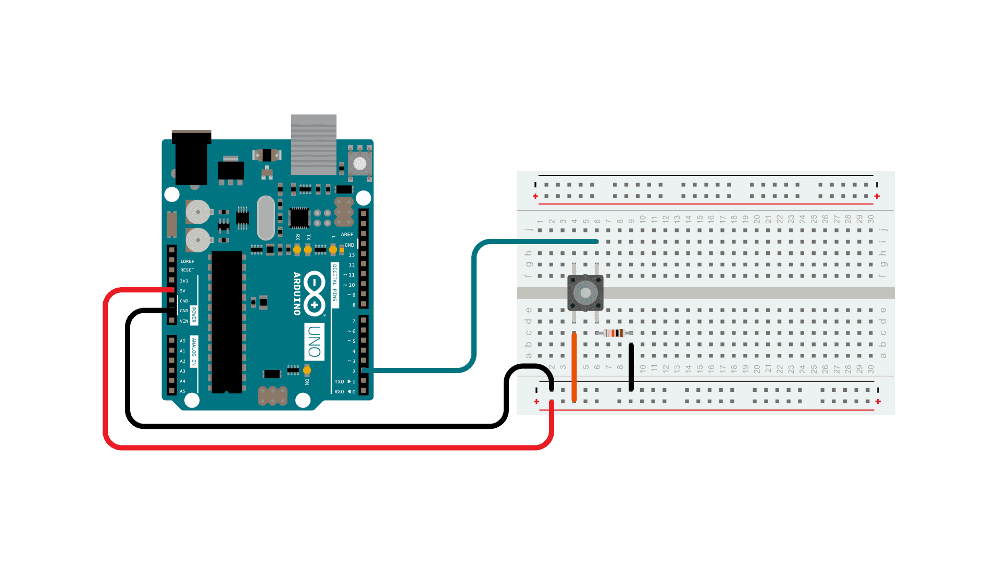

# Button Pressed Counter

This project demonstrates how to use a **push button** as a digital input on the Arduino.  
Every time the button is pressed, the program counts the number of presses and displays the result in the **Serial Monitor**.

---

## Code Overview

```cpp
const int buttonPin = 6;
int n = 0;
int buttonState = 0;

void setup() {
  Serial.begin(9600);
  pinMode(buttonPin, INPUT);
}

void loop() {
  buttonState = digitalRead(buttonPin);

  if(buttonState == HIGH) {
    n++;
    Serial.print("The button was pressed ");
    Serial.print(n);
    Serial.println(" times");
    delay(500);
  }
}
```

## Explanation

The button is connected to digital pin 6.

Each press is detected with digitalRead().

A counter (n) increments every time the button is pressed.

The result is displayed in the Serial Monitor at 9600 baud rate.

The delay(500) helps to avoid counting the same press multiple times due to bouncing.

## Circuit

button_circuit.png → Breadboard wiring diagram.



## Demo

A short video showing the circuit in action:

📹 [Watch the project running](./button_pressed_counter.mp4)
