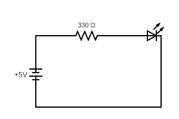
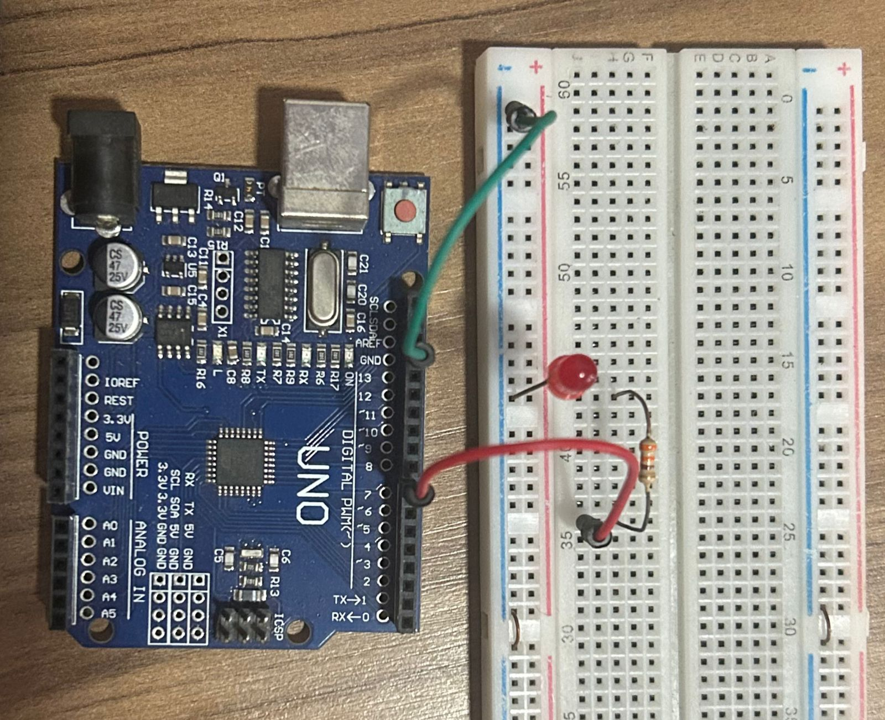

# Custom Blink

This project is a modified version of the default **Blink** example provided by the Arduino IDE.  
The goal of this code is to explain how **digital output pins** work on the Arduino board.  

---

## Code Overview

**File:** `arduino-labs/custom_blink/custom_blink/custom_blink.ino`

```cpp
const int LED_PIN = 7;

void setup() {
  pinMode(LED_PIN, OUTPUT);
}

void loop() {
  digitalWrite(LED_PIN, HIGH);
  delay(6000);
  digitalWrite(LED_PIN, LOW);
  delay(3000);
}
```

## Explanation

The LED is connected to digital pin 7.

In the setup(), the pin is configured as an OUTPUT.

In the loop():

The LED turns ON for 6 seconds.

Then it turns OFF for 3 seconds.

This modification from the default Blink code helps demonstrate how digital pins can be controlled to send HIGH (5V) or LOW (0V) signals.

## Circuit

circuit_1.png → Schematic diagram created with circuit design software.



circuit_2.jpg → Photo of the circuit assembled on the breadboard.



## Demo

A short video showing the circuit in action:

📹 [Watch the project running](./project_running.mp4)

## Requirements

Arduino IDE (or Arduino CLI)

Arduino board (e.g., Uno, Mega, Nano)

1 × LED

1 × 330Ω resistor

Breadboard and jumper wires

## Purpose

This simple project introduces how to:

Configure a digital pin as an output.

Control external components (like LEDs) with HIGH/LOW signals.

Use the delay() function to create timing intervals.