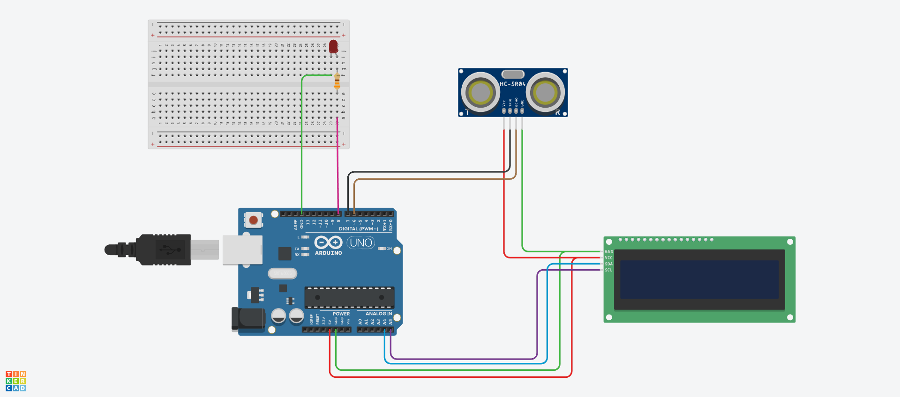

# WaterLevelController

WaterLevelController é um projeto educativo que utiliza o Arduino para medir a distância em um reservatório de água com o sensor ultrassônico HC-SR04, simulando o controle automático de uma bomba d’água. O sistema exibe a distância e o status da bomba em um display LCD I2C e aciona um LED (ou módulo relé) representando a bomba.

---

## Funcionalidades

- Mede a distância de um objeto (nível da água) com o sensor ultrassônico HC-SR04.
- Aciona um LED ou módulo relé quando a bomba deve ser ligada/desligada (controle automático).
- Exibe a distância e mensagens de status no display LCD 16x2 via interface I2C.
- Inclui mensagens de erro caso a leitura do sensor falhe.

---

## Materiais necessários

- Arduino Uno (ou compatível)
- Sensor ultrassônico HC-SR04
- Display LCD 16x2 I2C
- LED e resistor de 220Ω (ou módulo relé para acionar bomba real)
- Cabos jumpers
- Protoboard

---

## Diagrama de ligação

> Nota: no lugar do LED, você pode conectar um módulo relé para controlar a ligação da bomba de água real.

---

## Instalação e Configuração

### 1. Instalar a IDE Arduino

Baixe e instale a IDE Arduino em [https://www.arduino.cc/en/software](https://www.arduino.cc/en/software).

---

### 2. Instalar bibliotecas necessárias

Abra a IDE Arduino e siga os passos:

1. Vá em **Sketch > Include Library > Manage Libraries...**
2. Pesquise e instale as seguintes bibliotecas:
   - **HCSR04** – Biblioteca para sensor ultrassônico HC-SR04
   - **LiquidCrystal_I2C** – Biblioteca para o display LCD via I2C

---

### 3. Conectar os componentes

- **HC-SR04**
  - VCC → 5V
  - GND → GND
  - TRIG → Pino 6
  - ECHO → Pino 7
- **LED ou Módulo Relé**
  - LED: Anodo (+) → Pino 8, Catodo (-) → GND através de resistor 220Ω  
  - Relé: Sinal → Pino 8, VCC → 5V, GND → GND (aciona bomba real)
- **LCD I2C**
  - VCC → 5V
  - GND → GND
  - SDA → A4
  - SCL → A5

---

### 4. Carregar o código

1. Abra o arquivo `WaterLevelController.ino` na IDE Arduino.
2. Selecione a placa correta: **Tools > Board > Arduino Uno**.
3. Selecione a porta correta: **Tools > Port > (porta do Arduino)**.
4. Clique em **Upload** para enviar o código ao Arduino.

---

### 5. Testar o projeto

- Quando o Arduino iniciar, o LCD mostrará "Sensor iniciado".
- O LED ou relé acionará quando a bomba estiver "ligada" (nível de água abaixo do limite).
- O LCD mostrará constantemente a distância medida em cm.
- Caso haja falha na leitura do sensor, o LCD mostrará "Erro de leitura!".

---

## Estrutura do código

- **setup()**: Inicializa o display, configura pinos e exibe mensagem inicial.
- **loop()**: Mede a distância continuamente, atualiza o display e aciona o LED ou relé conforme o nível de água.

---

### Licença

Este projeto é open-source e pode ser usado para fins educacionais. Sinta-se à vontade para contribuir!
